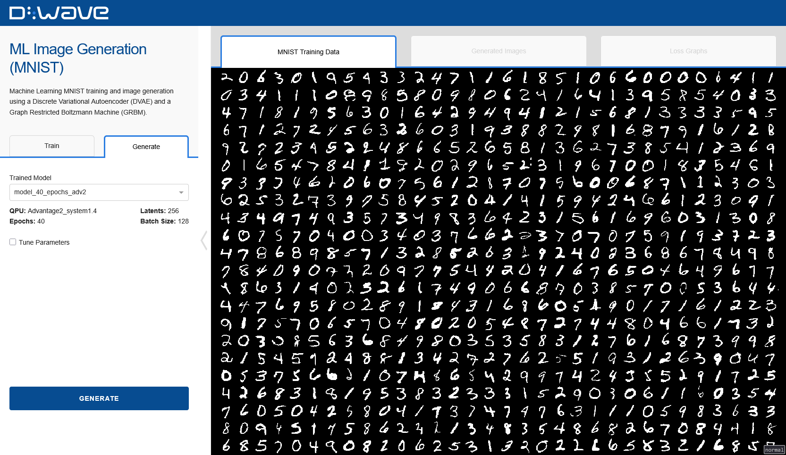
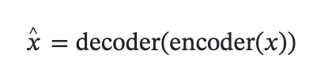
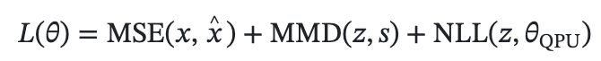
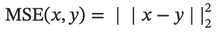
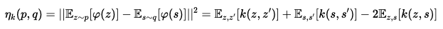
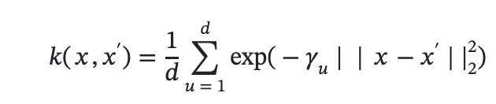
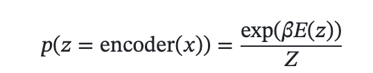
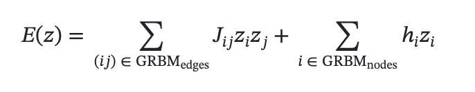
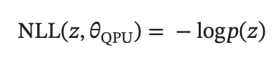

# Machine Learning Image Generation (MNIST)

This example showcases the use of hybrid quantum-classical machine learning architectures in the
context of the MNIST number digit dataset, generating 28x28-pixel images of hand-written numbers.

It uses an autoencoder architecture, where data is compressed to a latent space that acts as an
information bottleneck, and then decompressed in order to reconstruct the original data.
Compression and decompression are carried out by classical neural network models,
called "encoder" and "decoder", respectively. The latent space is a binary space, which translates
easily to the QPU.

A Graph-Restricted Boltzmann Machine (GRBM) model allows the QPU to learn the
couplings and biases of the qubits and model the data distribution
of spin strings arising from encoding the input data into the binary latent space. New data is then
generated by sampling spin strings from the trained QPU, and passing these to the decoder.




## Installation
You can run this example without installation in cloud-based IDEs that support the
[Development Containers specification](https://containers.dev/supporting) (aka "devcontainers")
such as GitHub Codespaces.

For development environments that do not support `devcontainers`, install requirements:

```bash
pip install -r requirements.txt
```

If you are cloning the repo to your local system, working in a
[virtual environment](https://docs.python.org/3/library/venv.html) is recommended.

## Usage
Your development environment should be configured to access the
[Leap&trade; quantum cloud service](https://docs.ocean.dwavesys.com/en/stable/overview/sapi.html).
You can see information about supported IDEs and authorizing access to your Leap account
[here](https://docs.dwavesys.com/docs/latest/doc_leap_dev_env.html).

Run the following terminal command to start the Dash application:

```bash
python app.py
```

Access the user interface with your browser at http://127.0.0.1:8050/.

The demo program opens an interface where you can configure problems and submit these problems to
a solver.

Configuration options can be found in the [demo_configs.py](demo_configs.py) file.

> [!NOTE]\
> If you plan on editing any files while the application is running, please run the application
with the `--debug` command-line argument for easier debugging:
`python app.py --debug`


## Variational Autoencoders

Variational autoencoders are machine learning models that learn latent representations of data
through an `encoder` and then reconstruct data from these latent representations using a `decoder`.
Put simply,



where _x_hat_ is the reconstruction of _x_.

The latent space has a special structure, that allows for sampling or "generating" data to be a
tractable step. This means that there exists a prior `p` distribution in the latent space that can
be sampled from from easily. Typically, this distribution could be a multivariate standard normal
distribution. Training the variational autoencoder needs the inclusion of a loss term (typically a
Kullback-Leibler (KL) divergence term) that makes sure the data is encoded to data that is
distributed according to such multivariate standard normal distribution.

The motivation behind having such a latent space is that it is easy to sample from and thus
generate data from, i.e. obtaining a latent vector `z` and passing it to the `decoder` will yield
realistic data if the `decoder` is powerful enough.
However, this means that the `encoder` needs to compress input data to a simplistic latent
representation.
To unburden the `encoder` (and also the `decoder`), a more complex latent space structure can be
considered.
To do so, a discrete (spin) latent space is modelled by a Boltzmann distribution using the
`GraphRestrictedBoltzmannMachine` from `dwave.plugins.torch.boltzmann_machine`, which allows for a
prior that learns probability distributions over the spin latent space of an autoencoder.

## Problem Description

The MNIST dataset consists of 60,000 28x28 pixel black and white images of hand-written digits.
A discrete variational autoencoder is trained on these images in order to create a generative model,
whose structure is defined in `dwave.plugins.torch.autoencoder` with a
`GraphRestrictedBoltzmannMachine` prior.

We minimize the following loss function:



whose terms correspond to a reconstruction loss (MSE), a distribution distance loss (MMD)
and a likelihood loss (NLL).

### Reconstruction Loss

The reconstruction loss considered in this problem is the mean squared error over the pixels that
form the original image _x_ and the reconstructed image _x_hat_, that is:



Other losses, including perceptual losses, could be used, but from the simplicity of this dataset,
we also keep a simple loss. It is worth noting that MSE could make the autoencoder produce blurry
images.

### Distribution Distance Loss

To ensure that the latent representation of data is aligned to that of the samples from the QPU,
we use the maximum mean discrepancy distance, which uses samples to estimate the distance between
two distributions. To measure the (squared) maximum mean discrepancy (&eta;\_k) between two
distributions _p_ and _q_, a kernel, _k_, is used:



where &varphi; is the feature map associated to the kernel _k_.

In this demo, a mixture of radial basis kernels are used:



where &gamma;\_u is _2^w_ for _w ∈ \{-d/2, -d/2+1, ..., d/2\}_. Thus _MMD(z,s)_ is evaluated
by sampling _z_ from the encoded data, and _s_ from the QPU to estimate the expectation values of
_&eta;\_k(encoded data, QPU)_.

### Likelihood Loss

Finally, we introduce a loss term that trains the QPU parameters to match the distribution of
encoded data in the latent space. For this, we train the couplings _(\{J\_ij\})_ and biases
_(\{h\_i\})_ of the QPU and train the QPU so that the encoded data in the latent space is distributed
according to a Boltzmann distribution defined by the QPU parameters, that is we aim for:



where _E(z)_ is the energy of _z_ with respect to the QPU parameters, i.e.,



and _Z_ is the partition function.

To ensure that the encoded data is distributed according to a Boltzmann distribution defined by the
QPU parameters, we minimize the negative log-likelihood of encoded data under the QPU Boltzmann
distribution:



## Model Overview

As previously mentioned, the model consists of an encoder, a decoder, and a
`GraphRestrictedBoltzmannMachine`. The encoder and decoder are neural networks for the MNIST
dataset and the output of the encoder will be interpreted as logits for spin variables in the
latent space.

There are typically two ways of converting logits into spin variables. The first way relies on the
straight-through estimator. If &ell; is a logit and _z_ is the corresponding spin variable, _z_ is
sent to the decoder (when reconstructing data) and &ell; is sent backwards, when computing any
gradients. The second way relies on relaxing the spin variables to a continuous distribution. This
is done by, for example, adding Gumbel noise to the logits. This effectively reparameterises the
randomness source, when sampling spin variables from logits, to sampling spin variables from Gumbel
noise. The logits act as deterministic information in the model, so that any expectation value on
the random spin variables is taken with respect to the Gumbel noise.

## Code overview

The important pieces showcased in this demo are the discrete variational autoencoder and
the `GraphRestrictedBoltzmannMachine` prior.

The discrete variational autoencoder is defined as:
```python
dvae = DiscreteVariationalAutoencoder(encoder, decoder, latent_to_discrete)
```
where `encoder` and `decoder` are pytorch models and `latent_to_discrete` is a function which
transforms the latent representation of data (the output of the encoder) to discrete or spin
variables.

The GRBM is defined by:
```python
grbm = GraphRestrictedBoltzmannMachine(
    graph.nodes,
    graph.edges,
)
```
where `graph` is some collection of nodes and edges that is to be embedded on the QPU.

These models are used to minimize the losses described by the above loss functions.


## License

Released under the Apache License 2.0. See [LICENSE](LICENSE) file.
